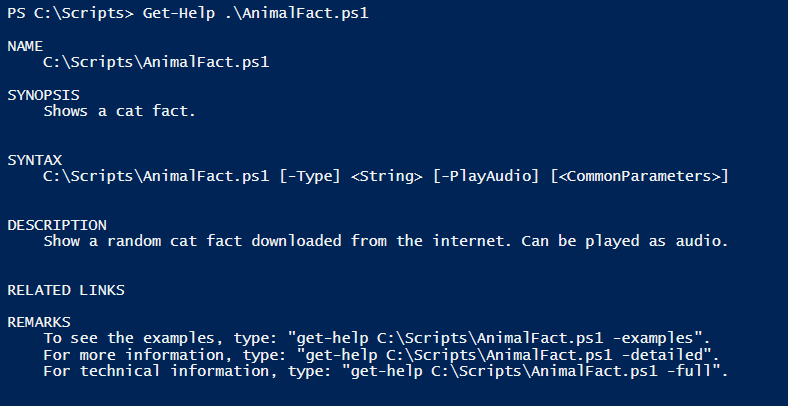
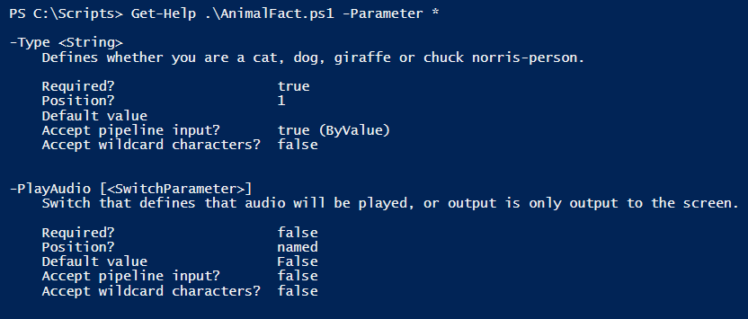
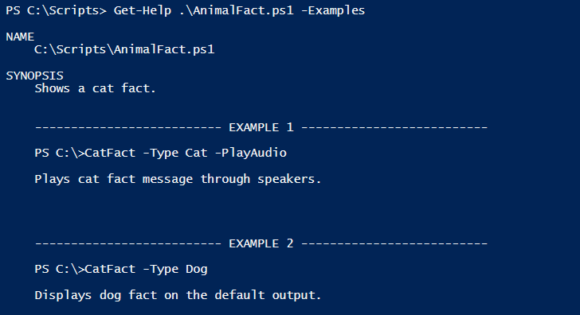

# The animalfact-script

The animalfact-script downloads a random cat or dog fact from the internet. The following code works, if the variables "$Type" and "$PlayAudio" have a value.

The code:

```PowerShell
$Type = "dog"
$PlayAudio = $true

Switch ($Type.ToLower()) {
    "cat" {
        $Fact = (ConvertFrom-Json (Invoke-WebRequest -Uri 'https://the-cat-fact.herokuapp.com/api/randomfact')).data.fact
    }
    "dog" {
        $Fact = (ConvertFrom-Json (Invoke-WebRequest -Uri 'https://dog-api.kinduff.com/api/facts')).facts
    }
    "giraffe" {
        $all = (Invoke-WebRequest -Uri 'http://www.randomgiraffefacts.com/index.cgi')
        $Fact = ($all.AllElements | Where-Object tagname -eq "H3" | Select-Object -First 1).innerHTML
    }
    "chuckNorris" {
        $Fact = (ConvertFrom-Json (Invoke-WebRequest -Uri 'https://api.chucknorris.io/jokes/random')).Value
    }
    default {
        $Fact = "A `"$type`" may or may not be a real animal."
    }
}

if ($PlayAudio) {
    Add-Type -AssemblyName System.Speech
    $SpeechSynth = New-Object System.Speech.Synthesis.SpeechSynthesizer
    $SpeechSynth.Speak($Fact)
}
else {
    write-output $Fact
}
```

## Parameters

Define the parameters required for the script.
* Type
	* String
	* Obligated
	* Is either "cat" or "dog"
* PlayAudio
	* Switch

The result will look like this…


And…


[Solution](About_scripts/Parameters_1.ps1)
## PowerShell version

The first addition we want to make is to require functionalities of the computer running the script. Since we don't need a module or administrator-access to the computer, we'll require PowerShell version 3.0.


[Solution](About_scripts/PowerShell_version_1.ps1)
## Help information

Make sure "get-help" displays adequate help-information about this script.

For example:








[Solution](About_scripts/Help_information_1.ps1)
## Verbose

Make the script verbose, i.e. the script will give a lot of information about what is going on while it is running.

Example:


[Solution](About_scripts/Verbose_1.ps1)
## The full script

For reference, the full script.
[Solution](About_scripts/The_full_script_1.ps1)


# The new VM-script

We have a script that we can use to create a new virtual machine on Hyper-V. It sets some basic settings.

The script would look like this right after the fun part of writing the actual script.

Script:
```PowerShell
$location = "C:\Virtual Machines"
$iso = "C:\ISO\en_windows_server_2016_x64_dvd_9327751.iso"
$name = "new VM 1"
$switchname = "172.24"

$vhdxname = Join-Path ( Join-Path ( Join-Path $location $name ) "HDs") "$name.vhdx"

New-VM -Name $name `
-MemoryStartupBytes 1GB `
-Path $location `
-Generation 2 `
-SwitchName $switchname `
-NewVHDPath $vhdxname `
-NewVHDSizeBytes 40GB `
-BootDevice CD

Get-VM -Name $name | Get-VMDvdDrive | Set-VMDvdDrive -Path $iso.FullName
Get-VM -Name $name | Set-VMMemory -DynamicMemoryEnabled $true -MaximumBytes 2GB -MinimumBytes 256MB
Get-VM -Name $name | Start-VM
```
## Parameters

First step is to add the obvious parameters. The 'obvious parameters' are the variables at the top of our script:
```PowerShell
$location = "C:\Virtual Machines"

$iso = "C:\ISO\en_windows_server_2016_x64_dvd_9327751.iso"

$name = "new VM 1"

$switchname = "172.24"
```


Turn these into parameters. Make sure you add the following added information:
* Location
	* Not obligated
	* Default value: "c:\Virtual Machines"
* ISO, name and switchname
	* Obligated

Note that compulsory parameters are generally put before non-compulsory parameters. That means that we'll be defining "Location" (non-compulsory) last.

Also, immediately add the cmdlet-binding. It's added automatically once at least one parameter is defined as mandatory.

The result will look like this.


[Solution](About_scripts/Parameters_HV_1.ps1)
## Switch start VM

Add a switch. If the switch is present, the virtual machine will be automatically started. If it isn't, it won't be.


[Solution](About_scripts/Switch_start_VM_1.ps1)
## Switch start VM – version 2

A switch is nice and uncomplicated. However, you can make it nice and complicated.

If the switch isn't present, we want the machine to be immediately started, but if it's passed as false, the machine won't start.


[Solution](About_scripts/Switch_start_VM_–_version_2_1.ps1)


You can test the behaviour of this parameter by adding the following lines right after the declaration of the parameters (and before the rest of the script):

```PowerShell
write-host $startVM

throw
```
The "Write-Host" will show the content of the variable, and "throw" will throw a fatal error and end the script before virtual machines are created.

This allows us to test the switch with a default value of true.

Do not include the switch: value is true


Include the switch without a value: value is true


Include the switch with a $false value, separated by a colon: value is false


## Requiring

Creating VMs requires the script be run as administrator, and the Hyper-V module be present.


[Solution](About_scripts/Requiring_1.ps1)
## Checking paths

We ask two paths of the user. But what if the user doesn't enter an existing file or folder for "$iso" or "$location"?

Check whether the given locations exist using the "Test-Path" cmdlet. Add some verbose messages if the path points to an existing location. Throw an error if they don't (using "throw").


[Solution](About_scripts/Checking_paths_1.ps1)

This works, but what if the user selects a file for the "location" parameter? And not an ISO for the ISO parameter?

Write some code to check this, and display an error. Although this is a nice feature, we won't be adding it to the final script for the sake of readability.


[Solution](About_scripts/Checking_paths_2.ps1)
## From ISO to type

We're allowing the user to select the ISO. We could also provide a number of ISO's ourselves, and let the user select an operating system.

For this sake, replace the ISO-parameter with a type-parameter. The list of options in the type-parameter is limited to those OS's that we have an ISO for.


[Solution](About_scripts/From_ISO_to_type_1.ps1)
## Limit the switchname

The "switchname"-parameter has to point to an existing Hyper-V switch. If it doesn't, the script won't work.

Limit the list of available switchnames to those present on the computer where the script is run. Use the Get-VMSwitch cmdlet to get the available switches.

```PowerShell
[ValidateSet({ (Get-VMSwitch).Name })]
[String]$switchname,
```


No, that won't work. You can use a scriptblock as a validateset, but creating a dynamic list of possible values isn't quite this easy. In fact, you need to write another script that gets all necessary information and stores it as a validationset…
## Comment based help

Finally, add some comment based help.

```PowerShell
#requires -runasadministrator
#requires -module Hyper-V

<#
.SYNOPSIS
Create a new VM.

.DESCRIPTION
Create a new VM in Hyper-V.

.PARAMETER type
The OS.

.PARAMETER name
Name of the VM.

.PARAMETER switchname
The name of the switch to which the VM will be connected.

.PARAMETER startVM
Whether or not the will be started after creation.

.PARAMETER location
The location of the VM.

.EXAMPLE
& '.\createVM.Ps1' -type "Windows Server 2016" -name 'My new 2016'

Creates a new VM running server 2016 in c:\Virtual Machines, called "My new 2016"

.EXAMPLE
& '.\createVM.Ps1' -type "Windows Server 2012R2" -name 'My new old server' -location c:\tmp -startVM

Creates a new VM running server 2012 R2 in c:\tmp, called "My new old server" and starts the VM.

.EXAMPLE
& '.\createVM.Ps1' -type "Ubuntu server 16.04" -name 'Playground'

Creates a new VM that you can use to acquire some understanding of the dark side.
#>

[cmdletbinding()]
param(
    #[Parameter(Mandatory=$true)][String]$iso,
    [Parameter(Mandatory = $true)]
    [ValidateSet("Windows Server 2016", "Windows Server 2012R2", "Ubuntu server 16.04")]
    [String]$type,
    [Parameter(Mandatory = $true)][String]$name,
    [Parameter(Mandatory = $true)]
    #[ValidateSet({ (Get-VMSwitch).Name })]
    [String]$switchname,
    [Switch]$startVM = $true,
    [String]$location = "C:\Virtual Machines"
)

if ( (Test-Path $location))
{
    write-Verbose "Location exists!"
}
else
{
    throw "Please select an existing location!"
}

switch ($type)
{
    "Windows Server 2016"
    { $iso = "C:\ISO\en_windows_server_2016_x64_dvd_9327751.iso" }
    "Windows Server 2012R2"
    { $iso = "C:\ISO\en_windows_server_2012_r2_x64_dvd_2707946.iso" }
    "Ubuntu server 16.04"
    { $iso = "C:\ISO\ubuntu-16.04.1-server-amd64.iso" }
}

$vhdxname = Join-Path ( Join-Path ( Join-Path $location $name ) "HDs") "$name.vhdx"

New-VM -Name $name `
-MemoryStartupBytes 1GB `
-Path $location `
-Generation 2 `
-SwitchName $switchname `
-NewVHDPath $vhdxname `
-NewVHDSizeBytes 40GB `
-BootDevice CD

Get-VM -Name $name | Get-VMDvdDrive | Set-VMDvdDrive -Path $iso.FullName
Get-VM -Name $name | Set-VMMemory -DynamicMemoryEnabled $true -MaximumBytes 2GB -MinimumBytes 256MB

if ($startVM)
{
    Write-Verbose "Starting the VM"
    Get-VM -Name $name | Start-VM
}
```
# The backupscript – Parameters and help

Remember the backupscript you wrote in "The backupscript – the script" in the exercises on writing scripts? Let's take that script, and make it a real script.

* Add a synopsis, description, descriptions for all parameters, and examples
* Make sure the parameters are actual parameters
	* The destination
	* The CSV-file
	* A switch "CreateLog"

Also, the CSV-file is quite specific in having only one member called "folder". Add a switch parameter called "CreateCSV". If that switch is true, nothing is backupped but a CSV-file is created. The user can edit this file to contain the correct folders.


[Solution](About_scripts/Comment_based_help_1.ps1)


